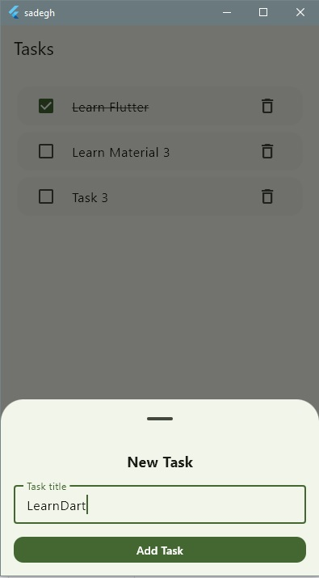
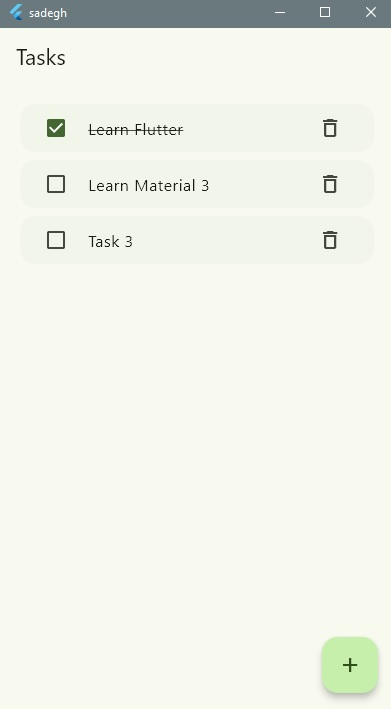

<<<<<<< HEAD
# sadegh

A new Flutter project.

## Getting Started

This project is a starting point for a Flutter application.

A few resources to get you started if this is your first Flutter project:

- [Learn Flutter](https://docs.flutter.dev/get-started/learn-flutter)
- [Write your first Flutter app](https://docs.flutter.dev/get-started/codelab)
- [Flutter learning resources](https://docs.flutter.dev/reference/learning-resources)

For help getting started with Flutter development, view the
[online documentation](https://docs.flutter.dev/), which offers tutorials,
samples, guidance on mobile development, and a full API reference.
=======
# flutter-m3-todo
flutter-m3-todo
A clean Flutter Todo app demonstrating Material 3 UI, Bottom Sheets, and modern Flutter architecture.

Features
Material 3 UI
NavigationBar navigation
Modal Bottom Sheet for creating tasks
SegmentedButton filtering
Modern Flutter project structure
Clean and simple Todo management
Getting Started
Clone the repository:

git clone https://github.com/SadeghN/flutter-m3-todo.git

Go to the project directory:

cd flutter-m3-todo

Install dependencies:

flutter pub get

Run the app:

flutter run

Project Structure
lib/

core/ → theme, colors, constants

features/ → models, screens, logic

widgets/ → reusable UI components

Built With
Flutter

Material 3

Author
Sadegh
## Screenshots

  
  

>>>>>>> 30f4c67458f004cb9bff162fe12ba8d16ef2d6d4
